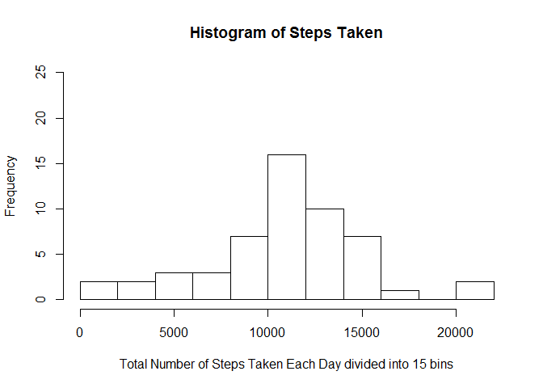
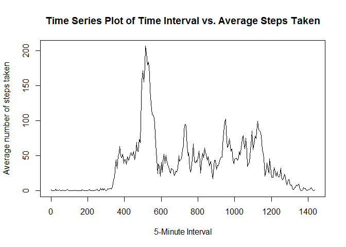
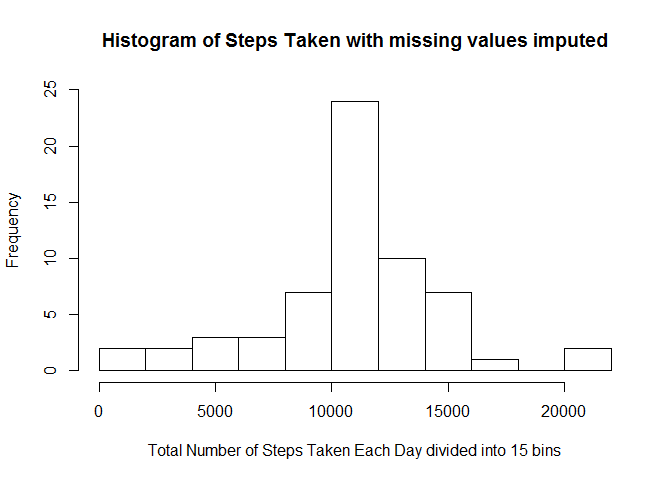
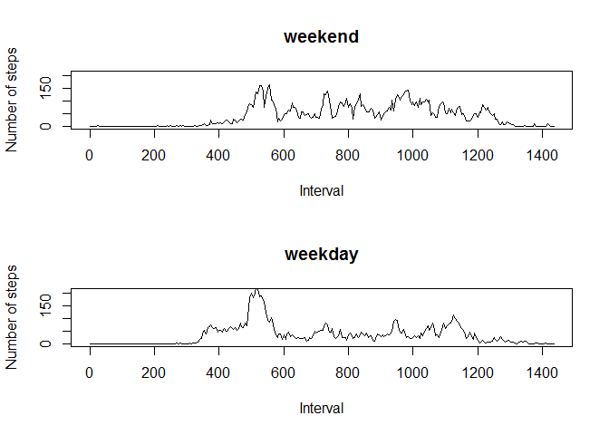

# Reproducible Research: Peer Assessment 1
Benay Dara-Abrams  
April 18, 2015  


## Loading and preprocessing the data
Read the Activity dataset into a data frame, rr_df.

```r
rr_df <- read.csv("RepData_PeerAssessment1/activity/activity.csv")
```

## What is mean total number of steps taken per day?
For this part of the assignment, the missing values in the dataset are ignored.
This section calculates the total number of steps taken by day.
Then a histogram of the total number of steps taken each day is plotted.
After the histogram is plotted, this section calculates the mean and median 
of the total number of steps taken per day.


```r
## Sum the number of steps taken by day.
steps_sum <- by(rr_df$steps, rr_df$date, sum, simplify = FALSE)
## Convert the number of steps into numeric.
total_steps <- as.numeric(steps_sum)
## Make a histogram of the total number of steps taken each day.
## Divide the histogram into 15 bins in order to understand the data.
## Add a title at the top of the histogram and on the x-axis.
hist(total_steps, main = "Histogram of Steps Taken", ylim = c(0, 25),
     xlab = "Total Number of Steps Taken Each Day divided into 15 bins", 15)
```

 

```r
## Calculate the mean of the total number of steps taken each day.
mean_steps <- mean(total_steps, na.rm = TRUE)
## Concatenate a title with the value of the mean of the total number of steps and print.
print_string <- paste("The mean of the total steps taken per day = ", mean_steps)
## Print result without quotation marks.
print(print_string, quote = FALSE)
```

```
## [1] The mean of the total steps taken per day =  10766.1886792453
```

```r
## Calculate the median of the total number of steps taken each day.
median_steps <- median(total_steps, na.rm = TRUE)
## Concatenate a title with the value of the median of the total number of steps and print.
print_string <- paste("The median of the total steps taken per day = ", median_steps)
print(print_string, quote = FALSE)
```

```
## [1] The median of the total steps taken per day =  10765
```
## What is the average daily activity pattern?
This section of code makes a time series plot of the 5-minute interval (on the x-axis)
and the average number of steps taken, averaged across all days (on the y-axis).
Then the maximum number of steps in any one 5-minute interval is calculated and
the index of the particular 5-minute interval in which the maximum occurred is determined.
After the index of that interval is found, the start time of that 5-minute interval
is converted into the hour and time, printed in 24-hour time format.

```r
## Calculate the average number of steps during each 5-minute interval across all days.
steps_average_by_interval <- by(rr_df$steps, rr_df$interval, mean, na.rm = TRUE, simplify = FALSE)
## Convert the average number of steps into numeric.
average_steps <- as.numeric(steps_average_by_interval)
## Calculate total number of minutes in a day
minutes_day <- (60 * 24)
## Make a time series plot of the 5-minute interval (x-axis) and
## the average number of steps taken, averaged across all days (on the y-axis).
## Add titles for main at top of plot as well as for the x-axis and y-axis.
plot(seq(0, (minutes_day - 5), by=5), main = "Time Series Plot of Time Interval vs. Average Steps Taken", xlab = "5-Minute Interval", ylab = "Average number of steps taken", average_steps, type="l")
```

 

```r
## Calculate the maximum number of steps in a 5-minute interval on average across all the days.
maximum_steps <- max(average_steps, na.rm = TRUE)
print_string <- paste("The maximum number of steps in a 5-minute interval on average across all days =", maximum_steps)
print(print_string, quote = FALSE)
```

```
## [1] The maximum number of steps in a 5-minute interval on average across all days = 206.169811320755
```

```r
## Determine the index of the 5-minute interval in which the maximum number of steps occurred.
max_index <- which(average_steps == maximum_steps)
print_string <- paste("The index of the 5-minute interval with the maximum number of steps =", 
                      max_index)
print(print_string, quote = FALSE)
```

```
## [1] The index of the 5-minute interval with the maximum number of steps = 104
```

```r
## Calculate the time of day represented by this 5-minute interval according to 24-hour time.
hour_of_day <- (max_index * 5) %/% 60
minute_of_hour <- (max_index * 5) - (hour_of_day * 60)
## Concatenate using paste0 and collapse to show time as hour:minutes with no spaces around colon.
print_string <- paste0("The start time, in 24-hour time, for 5-minute interval when maximum number of steps occurred is: ", hour_of_day, zero.print =":", minute_of_hour, collapse = NULL)
print(print_string, quote = FALSE)
```

```
## [1] The start time, in 24-hour time, for 5-minute interval when maximum number of steps occurred is: 8:40
```

## Imputing missing values
There are a number of days/intervals in which there are missing values, which are coded as NA.
The presence of missing days and therefore, missing values, may introduce bias into
some calculations or summaries of the data.
This section of code first calculates and reports the total number of missing values
in the dataset, that is, the total number of rows with NA's in them.
To deal with these missing values, the strategy followed was to fill in any NA
with the average number of steps taken in that particular 5-minute interval, 
averaged across all days.
Following that strategy, a new dataset was created equal to the original dataset
but with the missing data filled in.
Once the missing data was filled in, a histogram was produced showing 
the total number of steps taken each day.

To determine if these values differ from the estimates from the first part of the 
assignment, the histogram of the new dataset with the missing values filled in is compared
with the histogram of the original dataset with missing values ignored.
To make the comparison, we have set ylim to the same range (0 to 25) on both histograms.
Comparing the two histograms, we can see the impact of imputing missing data on
the estimates of the total daily number of steps is that the peak is higher for the dataset
with imputed values, but the overall shape is the same for both histograms.


```r
## Calculate and report total number of missing values in the dataset, that is,
## the total number of rows with NA's.
missing_indices <- which(is.na(rr_df$steps))
total_missing <- length(missing_indices)
## Concatenate and print explanatory text and total number of missing values in dataset.
print_string <- paste("Total number of missing values in dataset, i.e. total number of rows with NA's =", total_missing)
print(print_string, quote = FALSE)
```

```
## [1] Total number of missing values in dataset, i.e. total number of rows with NA's = 2304
```

```r
## Impute missing values by filling in any NA with the average number of steps taken
## in that particular 5-minute interval, averaged across all days.
## Create new data frame which is initialized to the original data frame.
rr_df_missing_filled <- rr_df
## Create temporary vector with indices of missing values.
temp_vec <- as.factor(rr_df_missing_filled[missing_indices, ]$interval)
## Replace missing values with average number of steps for that particular interval.
rr_df_missing_filled[missing_indices, ]$steps <- as.numeric(steps_average_by_interval[temp_vec])
## Calculate total number of steps taken each day with filled-in missing values.
steps_sum2 <- by(rr_df_missing_filled$steps, rr_df_missing_filled$date, sum, simplify = FALSE)
## Convert total number of steps to numeric.
total_steps2 <- as.numeric(steps_sum2)
## Make a histogram of the total number of steps taken each day with missing values imputed.
## Divide the histogram into 15 bins in order to understand the data.
## Add a title at the top of the histogram and on the x-axis.
## Set ylim to the same range for both histograms so they can be visually compared.
hist(total_steps2, main = "Histogram of Steps Taken with missing values imputed", 
     ylim = c(0, 25), xlab = "Total Number of Steps Taken Each Day divided into 15 bins", 15)
```

 

```r
## Calculate the mean of the total number of steps taken each day with missing values imputed.
mean_steps2 <- mean(total_steps2, na.rm = TRUE)
## Concatenate a title with the value of the mean of the total number of steps with missing values imputed and print.
print_string <- paste("The mean of the total steps taken per day with missing values imputed = ", mean_steps2)
## Print result without quotation marks.
print(print_string, quote = FALSE)
```

```
## [1] The mean of the total steps taken per day with missing values imputed =  10766.1886792453
```

```r
## Calculate the median of the total number of steps taken each day with missing values imputed.
median_steps2 <- median(total_steps2, na.rm = TRUE)
## Concatenate a title with the value of the median of the total number of steps with missing values imputed and print.
print_string <- paste("The median of the total steps taken per day with missing values imputed = ", median_steps2)
print(print_string, quote = FALSE)
```

```
## [1] The median of the total steps taken per day with missing values imputed =  10766.1886792453
```

## Are there differences in activity patterns between weekdays and weekends?
Using the dataset with the filled-in missing values, a new factor variable in the dataset is
created with two levels - "weekday" and "weekend" indicating whether a given date is a weekday or 
a weekend day.
Then a panel plot is produced using the R base plotting system. The panel plot contains a time series plot of the 5-minute interval (on the x-axis) and the average number of steps taken, averaged across all weekdays or weekend days (on the y-axis). 
Following the format in the README file in the GitHub
repository, these two time series plots are placed one above the other with the weekend plot
on top and the weekday plot directly under it. The range on the y-axis is set to the same values to allow for easier visual comparison of the two plots. 

Comparing the two plots, we can see that weekend activity is spread out more throughout the day than weekday activity. We can also see that weekday activity is more highly concentrated in the morning and there is a higher peak on a weekday morning than on a weekend morning.

```r
## Determine if there are differences in activity patterns between weekdays and weekends.
## Using dataset with filled-in missing values, create a new factor variable in dataset 
## with two levels to indicate whether a particular date is a weekday or a weekend day.
## First add a new column to the data frame and convert value to date format.
rr_df_missing_filled$day <- as.Date(rr_df_missing_filled$date)
## Use weekdays() function to convert date to day of the week.
rr_df_missing_filled$day <- weekdays(rr_df_missing_filled$day)
## If the day is Saturday or Sunday, make the value of the day variable weekend.
## If the day is Monday through Friday, make the value of the day variable weekday.
rr_df_missing_filled$day <- ifelse ((rr_df_missing_filled$day %in% c('Saturday', "Sunday")), "weekend","weekday")
## Make day into a factor variable with two levels - "weekday" and "weekend".
rr_df_missing_filled$day <- as.factor(rr_df_missing_filled$day)
## Create a list with interval and day as the factors to use in the by function.
factor_list <- list(rr_df_missing_filled$interval, rr_df_missing_filled$day)
## Calculate the average number of steps per day depending on whether the day 
## is a weekday or a weekend day.
steps_average_by_interval_wkend_or_wkday <- by(rr_df_missing_filled$steps, factor_list, mean, na.rm = TRUE, simplify = TRUE)
## Make a panel plot containing a time series plot of the 5-minute interval (x-axis) and
## the average number of steps taken, averaged across all weekday or weekend days (on the y-axis).
## Add titles for main at top of plot as well as for the x-axis and y-axis.
## Set ylim to be the same for both plots to aid in visual comparison of the values.
par(mfcol=c(2,1))
## Plot average number of steps taken on weekend days
plot(seq(0, (minutes_day - 5), by=5), main = "weekend", xlab = "Interval", ylim = c(0, 210),
     ylab = "Number of steps", steps_average_by_interval_wkend_or_wkday[,2], type="l")
## Plot average number of steps taken on weekday days
plot(seq(0, (minutes_day - 5), by=5), main = "weekday", xlab = "Interval", ylim = c(0, 210),
     ylab = "Number of steps", steps_average_by_interval_wkend_or_wkday[,1], type="l")
```

 
